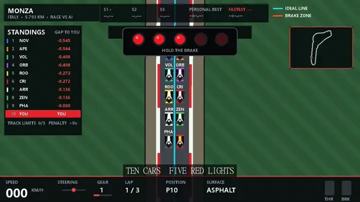

# Racing Line Pro — Telemetry Edition

使用 Python 与 Pygame 制作的轻量级方程式赛车游戏。

[](https://github.com/tzt302/game_racing/releases/latest)
[](https://github.com/tzt302/game_racing/releases/latest)
[](https://github.com/tzt302/game_racing/releases/tag/v2.4.6)

## 下载

推荐使用最新的 Windows 便携构建：

**[下载 RacingLinePro-v2.4.6-portable.zip](https://github.com/tzt302/game_racing/releases/download/v2.4.6/RacingLinePro-v2.4.6-portable.zip)**

- 文件大小：26,601,076 字节
- SHA-256：`63F0EAADA482E05118C769E9277349E2B797B0A0D7BEE9C80F8638691BE366B3`
- 系统：Windows 10 / 11 64 位
- 无需安装 Python；完整解压 ZIP 后运行文件夹内的 `RacingLinePro.exe`
- 请勿只把 EXE 单独拖出文件夹，旁边的 `_internal` 目录是运行所必需的

> [!WARNING]
> 2.4.3、2.4.4 和 2.4.5 的单文件 Windows EXE 均已撤回。Microsoft Defender 最新病毒库会拦截这些旧包；请勿关闭杀毒软件、添加白名单或恢复隔离文件。2.4.6 改用不自解压的目录式 ZIP，并删除了自动下载和替换自身的更新程序。

## v2.4.6 安全打包修复

2.4.6 保留 2.4.5 的全部转向修复，但不再发布 PyInstaller 单文件自解压 EXE。游戏改为普通目录式便携包，运行文件、Python 运行库和资源分别存放；同时彻底移除下载、暂存、覆盖并重启游戏自身的自动更新代码。后续版本请从本项目的 GitHub Releases 页面手动获取。

发布前完成 38 项自动化测试、目录式成品窗口启动验证，并使用 Microsoft Defender 安全情报 `1.455.279.0` 分别扫描完整目录和最终 ZIP，结果均为 `found no threats`。

## v2.4.5 转向能力修复（Windows EXE 已撤回）

2.4.5 修复手柄转向被输入层与物理层重复衰减的问题：摇杆死区外的物理行程不再先做平方处理，只保留车辆物理中的单一渐进曲线。高速下压力同步重新标定，300 km/h 的可用横向能力由约 3.6 G 提升至约 5.7 G；五条内置赛道至少 90% 的参考圈采样点现已处于车辆可达范围内。低速机械抓地、最大机械舵角和转向齿条响应保持不变。

2.4.5 发布后的新版 Microsoft Defender 安全情报将其单文件 EXE 检测为 `Trojan:Win32/Wacatac.B!ml`。该资产已撤回；不要恢复或运行被隔离的旧文件。转向代码修复已完整包含在 2.4.6 中。

## v2.4.4 Windows 安全构建（Windows EXE 已撤回）

针对 2.4.3 被 Microsoft Defender 启发式判定为 `Trojan:Win32/Wacatac.B!ml` 的问题，2.4.4 移除了隐藏 PowerShell 更新流程与 UPX 压缩，并精简无关打包模块、加入标准 Windows 版本资源。自动更新仍校验 GitHub Release 来源、文件名、大小和 SHA-256，但替换动作由受限的游戏自身更新助手完成，不再调用命令行外壳。

项目尚未购买商业代码签名证书，因此 Windows SmartScreen 仍可能显示“未知发布者”；这与杀毒软件检测到恶意程序不是同一类提示。不要关闭杀毒软件运行任何被明确检测为木马的旧版本。

发布前验证：

- 40 项自动化测试全部通过
- 发布时的 Defender 扫描曾返回 `found no threats`，但后续安全情报已重新判定该单文件 EXE；此历史结果已经失效，资产现已撤回
- EXE 产品版本：`2.4.4.0`
- 自动更新不再调用 PowerShell、`cmd.exe` 或其他命令行外壳

## v2.4.3 高速下压力平衡

适度提高随车速平方增长的空气动力学抓地力，改善中高速弯的转向不足。低速机械抓地、方向输入曲线和物理舵角保持不变，因此发卡弯不会重新变得过度灵敏。

## v2.4.2 稳定性与自动更新

- 赛道、路肩和缓冲区改用固定宽度几何绘制，修复车辆过弯、俯视镜头旋转时赛道边缘看似拉伸或收缩的问题。
- 持续逆向行驶会被提示、减速并在 2.4 秒后自动按正确方向复位；计时赛发生逆向复位时本圈成绩作废。
- Windows EXE 启动后会后台检查本仓库最新正式 Release。新版本下载完成后会在主菜单提示，正常退出游戏即可自动安装并重启。
- 更新包必须同时通过仓库来源、精确文件名、文件大小和 GitHub Release SHA-256 校验。源码运行不会触发自动更新。

## v2.4.1 启动热修复

修复 2.4.0 Windows 单文件版遗漏 `game` Python 包、启动时报
`ModuleNotFoundError: No module named 'game'` 的问题。游戏内容和操控参数保持不变。

## v2.4.0 真实操控与计时整合更新

2.4.0 统一整合原计划中的 2.3.3—2.3.6 改进：重新设计转向输入与轮胎响应，
加入真实松油发动机制动、个人最快圈 Delta 和计时赛删圈规则，并删除全部声音效果。
高速转向现在由横向加速度需求、轴距、转向不足梯度、轮胎抓地、空气动力下压力和
摩擦圆共同决定；低速仍保留发卡弯需要的机械舵角。

## 实录宣传视频

[](https://github.com/tzt302/game_racing/releases/download/v2.3.2/RacingLinePro-v2.3.2-Promo.mp4)

点击动态预览可观看 1080p 实机宣传片：蒙扎十车正赛、五盏红灯、真实大奖赛发动机实录、实时 Delta、AI 时间差和赛道限制系统。

## 核心功能

- **个人最快圈 Delta**：完成首个计时圈后，逐点比较当前圈与自己的最快圈轨迹；绿色代表领先、红色代表落后。
- **完整正赛排名**：左侧显示十车实时名次，以及每辆 AI 相对玩家的时间差。
- **真实赛道限制规则**：计时赛越界直接删除本圈；AI 正赛每三次完整出界累计 5 秒罚时。
- **真实遥测赛道**：斯帕、银石、蒙扎、摩纳哥和上海均基于 2025 排位赛最快圈 X/Y/Z 遥测，每约 5 米一个采样点。
- **真实理想线**：以真实排位赛曲率和刹车数据识别弯心，连续生成外侧入弯、内侧弯心、外侧出弯的走线。
- **F1 三计时段**：真实 Sector 1/2 分界、毫秒计时，以及紫色全场最快、绿色个人提升、黄色未提升状态。
- **完整成绩比较**：分段时间、个人最快圈和当前圈相对个人最佳的实时差值。
- **线性模拟输入**：LT/RT 从 0% 到 100% 完整映射物理行程。
- **动态单轨转向物理**：横向 G 请求、固定机械舵角、轻微转向不足梯度、轮胎松弛响应、摩擦圆、空气动力下压力和受控侧滑共同决定车辆转向。
- **松油发动机制动**：发动机制动力随转速和挡位变化，并与空气阻力、滚动阻力共同形成更真实的滑行减速。
- **多车 AI**：九名具有不同速度、侵略性和稳定性的 AI，会尝试超车、发生小失误并进行车体接触。
- **完整正赛发车**：玩家与九辆 AI 组成十车发车阵容，采用双列发车位和五盏红灯起步程序。
- **可调视野范围**：菜单提供标准、宽广和超宽三档，比赛中也可即时缩放。
- **无声音效果**：2.4.0 不加载或播放发动机、换挡、回火及轮胎声音，发行包不包含音频素材。
- **经典俯视视角**：保留最原始的旋转俯视追踪视角，不使用 Halo 或驾驶舱遮挡赛道。
- **完整赛道表面**：沥青、红白路肩、缓冲区、草地和护栏具有不同交互。

## AI 强化学习开发档案

仓库包含 [强化学习步骤档案](docs/RL_TRAINING_PLAN.md)、Gymnasium 环境骨架、
SAC 训练入口和 Easy / Normal / Hard 策略适配层。训练入口默认只输出计划，
必须显式加入 `--start-training` 才会开始消耗算力；目前尚未运行训练或生成模型。

## 操作

| 按键 | 功能 |
| --- | --- |
| `W` / `↑` | 油门 |
| `S` / `↓` | 刹车 |
| `A D` / `← →` | 转向 |
| `R` | 回到赛道 / 重新开始 |
| `Esc` | 暂停 |
| `F1` | 打开车手指南 |
| `L` | 显示或隐藏赛车线 |
| `B` | 显示或隐藏刹车标记 |
| `-` / `[` | 扩大视野范围 |
| `+` / `]` | 缩小视野范围 |

手柄默认使用左摇杆转向、RT 线性油门、LT 线性刹车、A 确认/回到赛道、Start 暂停。

## 运行与测试

```powershell
python -m pip install -r requirements.txt
python main.py
python -m unittest discover -s tests -v
```

构建 Windows 便携目录：

```powershell
pyinstaller --noconfirm --clean RacingLinePro-portable.spec
```

从后续版本开始，Windows 主发布物改为标准安装包，便携 ZIP 作为备用。安装包以目录式构建为输入，不包含自动下载或替换自身的更新器：

```powershell
winget install --id JRSoftware.InnoSetup --exact
powershell -ExecutionPolicy Bypass -File tools/build_windows_installer.ps1
```

构建脚本会在生成安装包后调用 Microsoft Defender 扫描；扫描未通过时必须停止发布。项目尚未配置商业代码签名证书，因此 Windows 仍可能显示“未知发布者”，但不应关闭安全软件绕过明确的病毒检测。

重新导入 FastF1 遥测（仅开发者需要）：

```powershell
python -m pip install -r requirements-dev.txt
python tools/import_fastf1_tracks.py
```

数据、音频来源和许可信息见 [TRACK_SOURCES.md](TRACK_SOURCES.md)。

本项目是非官方作品，与 Formula 1、车队、车手或任何赛道运营方无关联。
