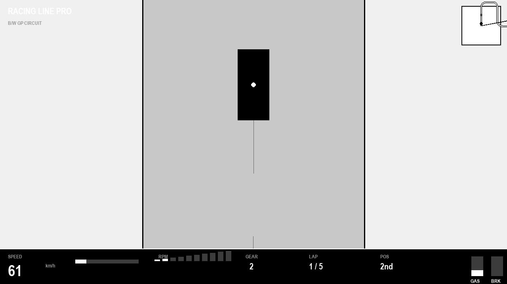
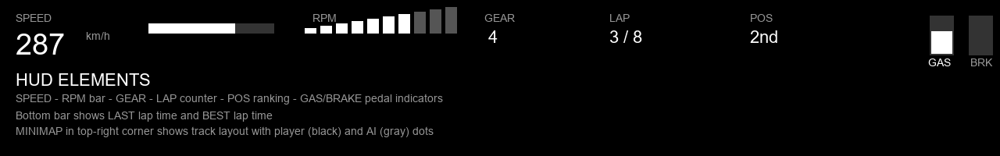

# Racing Line Pro 🏁

**一款独立超级轻量化2D赛车游戏** — 俯视角卷轴赛车，黑白极简画风，支持键盘与手柄。


*游戏中实机截图：俯视角赛道、实时HUD、黑白极简画风*

---

## 游戏特色

### 🏎️ 核心玩法
- **俯视角卷轴赛车** — 车辆从屏幕下方驶向上方，赛道随车辆前进滚动
- **真实比例** — 车辆与赛道按真实赛车比例缩放（1m = 40px）
- **AI 对战** — AI 对手实时竞速，智能过弯与走线
- **经典驾驶操控** — 油门 / 刹车 / 转向踏板
- **理想赛车线** — 赛道内绘制最佳过弯路径
- **刹车点提示** — 入弯前标注刹车区域

### 🎮 手柄支持
- **Xbox / PlayStation / 通用手柄** — 即插即用
- **左摇杆** — 转向控制
- **右扳机 (RT)** — 油门
- **左扳机 (LT)** — 刹车
- **方向键上下** — 油门 / 刹车
- **A 键** — 重置车辆位置

### ⌨️ 键盘控制

| 按键 | 操作 |
|------|------|
| `W` / `↑` | 油门 |
| `S` / `↓` | 刹车 |
| `A` / `←` | 左转向 |
| `D` / `→` | 右转向 |
| `R` | 重置位置 / 重新开始 |
| `Esc` | 暂停 |

### 📊 实时 HUD



| 元素 | 说明 |
|------|------|
| **SPEED** | 实时车速 (km/h)，附带进度条 |
| **RPM** | 10段 LED 转速光条 |
| **GEAR** | 模拟档位显示 |
| **LAP** | 当前圈数 / 总圈数 |
| **POS** | 当前位置（1st / 2nd） |
| **GAS / BRK** | 踏板力度指示器 |
| **MINIMAP** | 赛道小地图 + 车辆位置 |
| **LAST / BEST** | 上一圈 / 最佳圈速 |

---

## 技术架构

### 🚗 物理引擎（2D Bicycle Model）

采用经典自行车模型作为车辆动力学核心，开源实现：

```
x += v * cos(theta) * dt
y += v * sin(theta) * dt
theta += v * tan(delta) / L * dt         // 横摆角
v += (throttle * accel - brake * brake_force
      - drag * v^2 - rolling_resistance) * dt
delta += (target - delta) / steer_response  // 转向滞后
```

**关键物理参数：**
- `L = 2.6m` — 轴距
- `accel = 15 m/s²` — 最大加速度
- `brake = 30 m/s²` — 最大制动减速度
- `drag = 0.0015` — 空气阻力系数（限极速~350 km/h）
- `max_steer = 0.6 rad` — 最大转向角

**刹车点计算：**
```
brake_distance = v² / (2 * μ * g) + safety_margin
```

### 🤖 AI 对手
- **动态预瞄** — 根据车速自动调整预瞄距离
- **曲线预判** — 提前检测前方弯道曲率，自动调整速度
- **三档难度** — EASY / NORMAL / HARD

### 🛤️ 赛道系统
- **样条曲线赛道生成** — 8段式赛道（4条直道 + 4个弯道）
- **总长约 846m** — 圈速约 12-15 秒
- **内置数据** — 理想走线 / 刹车区域 / 曲率图

---

## 快速开始

```bash
# 克隆仓库
git clone https://github.com/tzt302/game_racing.git
cd game_racing

# 安装依赖
pip install -r requirements.txt

# 启动游戏
python main.py
```

### 依赖
- Python 3.10+
- Pygame 2.5+
- NumPy

---

## 项目结构

```
game_racing/
├── main.py                 # 游戏入口
├── config.py               # 配置与常量
├── requirements.txt        # 依赖
├── assets/                 # 图片资源
│   ├── screenshot.png      # 游戏截图
│   ├── gameplay_mockup.png # 概念设计图
│   └── architecture.png    # 架构图
├── src/
│   ├── physics/
│   │   ├── vehicle.py      # 车辆动力学（Bicycle Model）
│   │   └── __init__.py
│   ├── track/
│   │   ├── track.py        # 赛道生成与管理
│   │   └── __init__.py
│   ├── ai/
│   │   ├── opponent.py     # AI 对手（路径跟随 + 速度控制）
│   │   └── __init__.py
│   ├── ui/
│   │   ├── hud.py          # HUD 渲染
│   │   └── __init__.py
│   └── game/
│       ├── loop.py         # 游戏主循环
│       ├── input.py        # 输入处理（键盘 + 手柄）
│       └── __init__.py
└── README.md
```

---

## 开发路线图

### Phase 1 — 核心框架 ✅
- [x] 项目骨架与模块结构
- [x] 物理引擎（Bicycle Model）
- [x] AI 对手基础实现
- [x] 赛道生成系统
- [x] HUD 与 UI
- [x] 键盘 + 手柄输入支持

### Phase 2 — 打磨与扩展 🔄
- [ ] 多圈计时与排名
- [ ] 赛后数据统计
- [ ] 更具挑战性的赛道布局
- [ ] 碰撞动画与视觉反馈
- [ ] 圈速排行榜（本地）

### Phase 3 — 进阶功能
- [ ] 赛道编辑器
- [ ] 回放系统
- [ ] 多种赛车选择（不同操控特性）
- [ ] 联网对战

---

## 开源物理参考

车辆物理模型参考：
- [2D Bicycle Model](https://github.com/topics/bicycle-model) — 车辆动力学仿真
- [Pygame Vehicle Physics](https://github.com/topics/pygame-physics) — 社区物理示例

> 物理引擎采用 MIT 协议，完全开源可修改。

---

## 许可证

MIT License © 2026 tzt302

---

*截图中的画面为游戏实际渲染效果，最终版本可能会有所调整。*