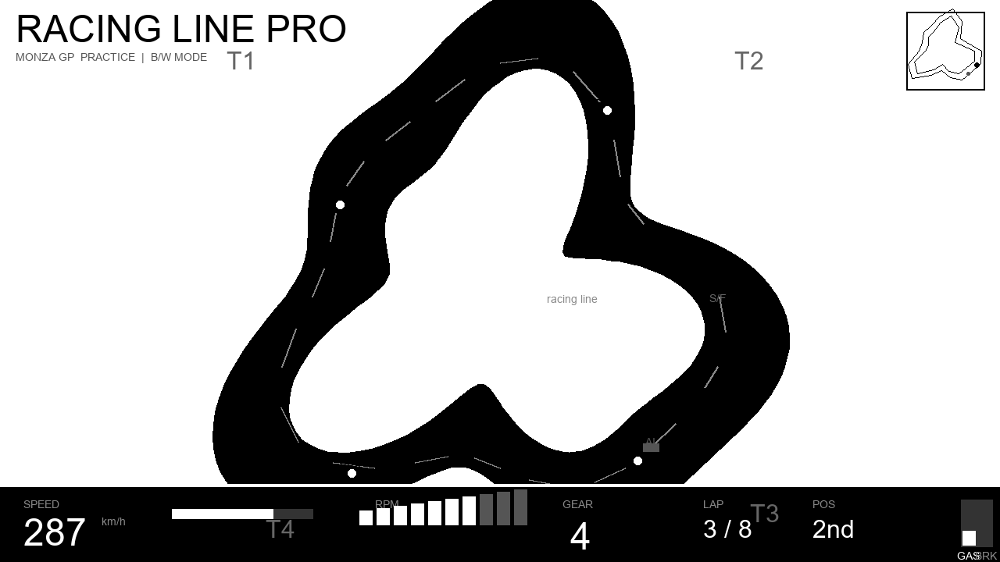
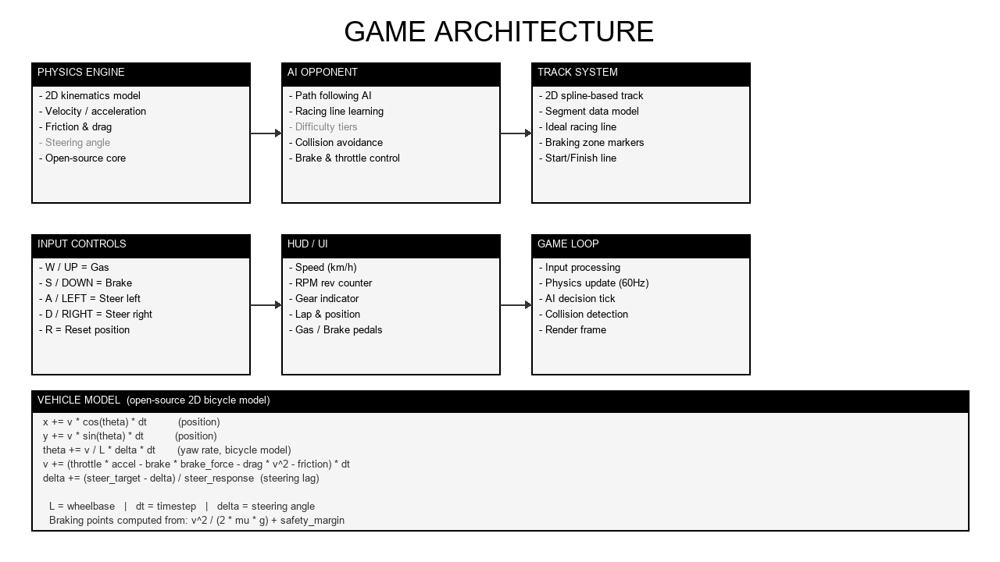

# Racing Line Pro 🏁

**一款独立超级轻量化2D赛车游戏** — 黑白极简画风，聚焦纯粹的驾驶体验。


*主游戏界面：2D赛道俯视视角、实时HUD、理想赛车线与刹车点*

---

## 游戏特色

### 🎮 核心玩法
- **2D 俯视赛道** — 流畅的曲线赛道，基于样条曲线生成
- **AI 对战** — 选择与 AI 对手同场竞技，AI 自动学习理想走线
- **经典驾驶操控** — 油门 / 刹车 / 转向，还原真实驾驶手感
- **理想赛车线** — 赛道内绘制最佳过弯路径，帮助玩家提升圈速
- **刹车点提示** — 入弯前清晰标注刹车区域，降低上手门槛

### 🎨 视觉风格
- **黑白配色** — 极简高对比，专注驾驶信息，回归游戏本质
- **无干扰 UI** — 精简的 HUD 元素，仅显示最关键的数据
- **流畅 60fps** — 轻量化渲染管线，任何设备均可流畅运行

### 📊 实时 HUD

| 元素 | 说明 |
|------|------|
| **SPEED** | 实时车速 (km/h)，附带进度条指示 |
| **RPM** | 发动机转速表，10段 LED 光条 |
| **GEAR** | 当前档位 |
| **LAP** | 当前圈数 / 总圈数 |
| **POS** | 当前位置排名 |
| **GAS / BRK** | 油门 / 刹车踏板力度指示器 |
| **MINIMAP** | 赛道小地图，实时显示自车与 AI 位置 |

---

## 技术架构


*系统架构总览 — 六大模块 + 开源物理模型*

### 物理引擎 (开源自行车模型)
采用经典的 **2D 自行车模型 (Bicycle Model)** 作为车辆动力学核心，开源实现，代码精炼可读：

```
x += v * cos(theta) * dt           // 纵向位移
y += v * sin(theta) * dt           // 横向位移
theta += v / L * delta * dt        // 横摆角速度（自行车模型）
v += (throttle * accel - brake * brake_force - drag * v^2 - friction) * dt
delta += (steer_target - delta) / steer_response   // 转向滞后
```

**关键参数：**
- `L` — 轴距（稳定性和转弯半径）
- `drag` — 空气阻力系数（速度越高影响越大）
- `friction` — 轮胎与路面摩擦
- `steer_response` — 转向响应时间常数

**刹车点计算：**
```
brake_distance = v^2 / (2 * mu * g) + safety_margin
```
根据当前车速、轮胎摩擦系数和重力加速度，动态计算最佳刹车距离，并在赛道上高亮标注。

### AI 对手
- **路径跟随** — AI 沿预计算理想走线行驶
- **难度可调** — 支持 EASY / NORMAL / HARD 三档
- **速度适应** — AI 根据玩家表现动态调整节奏
- **碰撞规避** — 检测近距离车辆并减速让行

### 赛道系统
- 基于 **2D 样条曲线** 生成赛道形状
- 每条赛道包含：内外边界、理想走线、刹车区、发车格
- 内置多条赛道（Monza GP、Sprint Circuit 等）

---

## 操作系统

### 键盘控制

| 按键 | 操作 |
|------|------|
| `W` / `↑` | 油门 (加速) |
| `S` / `↓` | 刹车 (减速) |
| `A` / `←` | 左转向 |
| `D` / `→` | 右转向 |
| `R` | 重置位置 (回到赛道) |
| `Space` | 暂停 / 继续 |
| `Esc` | 返回主菜单 |
| `Tab` | 切换视角 / 后视 |

### 游戏模式
1. **计时赛 (Time Trial)** — 独自刷圈，挑战个人最佳
2. **AI 对战 (Vs AI)** — 选择难度，与 AI 同场竞技
3. **练习模式 (Practice)** — 自由驾驶，熟悉赛道

---

## 快速开始

```bash
# 克隆仓库
git clone https://github.com/tzt302/game_racing.git
cd game_racing

# 安装依赖
pip install -r requirements.txt

# 启动游戏
python main.py
```

### 需求环境
- Python 3.10+
- Pygame 2.5+
- NumPy
- (可选) Matplotlib — 用于赛后数据分析

---

## 项目结构

```
game_racing/
├── main.py                 # 游戏入口
├── requirements.txt        # 依赖清单
├── assets/                 # 图片与资源
│   ├── gameplay_mockup.png # 游戏界面预览
│   └── architecture.png    # 架构示意图
├── src/
│   ├── physics/            # 物理引擎模块
│   │   ├── vehicle.py      # 车辆动力学模型
│   │   └── collision.py    # 碰撞检测
│   ├── ai/                 # AI 对手模块
│   │   ├── opponent.py     # AI 对手逻辑
│   │   └── pathfinding.py  # 路径规划
│   ├── track/              # 赛道系统
│   │   ├── track.py        # 赛道生成与管理
│   │   ├── racing_line.py  # 理想走线计算
│   │   └── braking.py      # 刹车点系统
│   ├── ui/                 # 用户界面
│   │   ├── hud.py          # HUD 显示
│   │   ├── menu.py         # 菜单系统
│   │   └── minimap.py      # 小地图
│   └── game/               # 游戏核心
│       ├── loop.py         # 游戏主循环
│       ├── input.py        # 输入处理
│       └── state.py        # 游戏状态管理
└── README.md
```

---

## 开发路线图

### Phase 1 — 核心框架 ✅
- [x] 项目骨架搭建
- [x] 物理引擎选型（Bicycle Model）
- [x] 视觉概念设计
- [ ] 基础赛道生成
- [ ] 车辆控制与 HUD

### Phase 2 — 核心玩法
- [ ] AI 对手实现
- [ ] 多赛道支持
- [ ] 碰撞检测系统
- [ ] 计时与时序系统

### Phase 3 — 打磨与扩展
- [ ] 圈速记录与排行榜
- [ ] 刹车点智能提示
- [ ] 赛后数据分析图表
- [ ] 赛道编辑器

---

## 开源物理参考

本游戏车辆的物理模型参考了以下开源项目：

- [**2D Bicycle Model**](https://github.com/topics/bicycle-model) — 广泛用于车辆动力学仿真的简化模型
- [**Pygame Vehicle Physics**](https://github.com/topics/pygame-physics) — Pygame 社区的多项物理示例

> 物理引擎采用 MIT 协议，完全开源可修改。

---

## 许可证

MIT License © 2026 tzt302

---

*此 README 中的图片为概念设计稿，最终游戏画面可能有所调整。*
